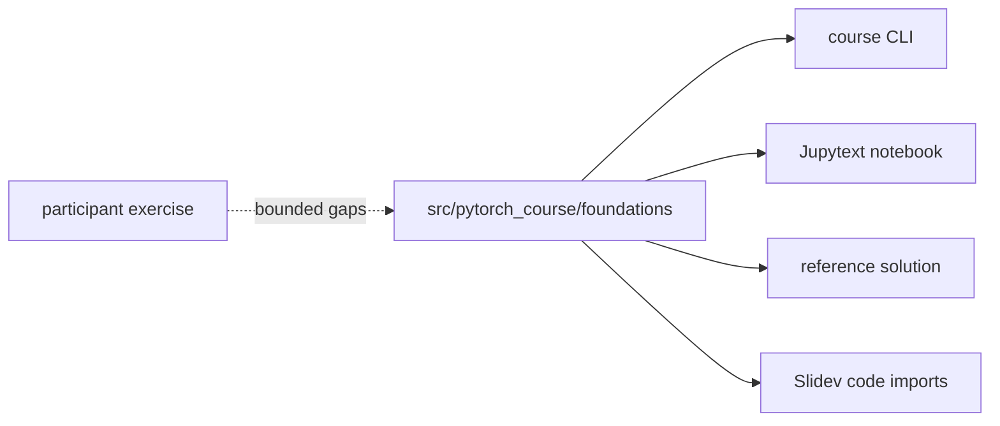

# Learning contract

By the end of this slice, you can:

- inspect tensor `shape`, `dtype`, and `device`;
- explain why a model and its inputs must share a device;
- identify the five operations in an optimization step;
- distinguish training loss from held-out evaluation accuracy;
- reproduce a deterministic learning signal.

---

# Start with observable state

```bash
PYTHONPATH=src python -m pytorch_course.cli prep tensor-device --device cpu
```

<<< @/snippets/pytorch_course/foundations/tensors.py#tensor-device-diagnostic

---

# Device selection is explicit

```text
workstation without PyTorch   slides and authoring only
container on CPU              --device cpu
Alps GPU allocation           --device cuda
portable example              --device auto
```

<Admonition title="One invariant" color="sky-light">
Model parameters, inputs, and targets used by one operation must be on compatible devices.
</Admonition>

---

# A nonlinear, offline dataset

Four noisy clusters form an XOR-like problem:

```text
class 0          class 1
(-1, -1)         (-1,  1)
( 1,  1)         ( 1, -1)
```

- generated from a fixed seed;
- no download or network access;
- balanced train/evaluation split;
- not separable by one linear boundary.

---

# The explicit optimization loop

<<< @/snippets/pytorch_course/foundations/mlp.py#explicit-training-loop

The order is part of the algorithm, not boilerplate to hide.

---

# Exercise, solution, notebook, and slides



One executable implementation; several educational views.

---

# Run the same contract

```bash
PYTHONPATH=src python -m pytorch_course.cli train mlp \
  --device cpu \
  --seed 7 \
  --json \
  --output build/reports/phase1-cpu.json
```

A successful run must show:

- final training loss below 35% of initial loss;
- held-out accuracy of at least 95%;
- `status: "pass"` in the JSON report.

---
layout: center
---

# Then implement it yourself

`exercises/day1/mlp.py`

Five operations. One observable learning signal.
