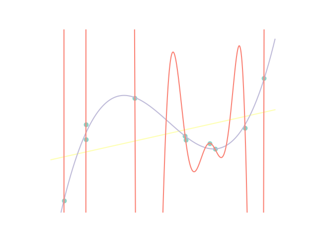
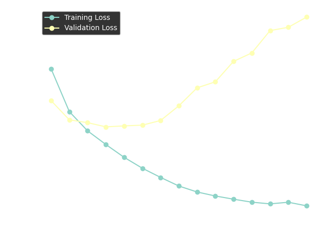

# More on Training

---

# Overfitting

Overfitting happens when a model has too many parameters compared to the training data.

$$
  f(x) \approx \sum_i w_i x^i
$$

<style>
    img {
        margin: auto;
    }
</style>


---

# Overfitting and Learning Curves

<div grid="~ cols-2 gap-4">
<div>



</div>
<div>

Low training loss and high validation loss indicate overfitting.

The large gap represents the generalization error.

The model was performing better early on in the training, but then started to overfit.

</div>
</div>

---

# Early Stopping

Stop training when the validation error reaches a minimum.

*A trivial implementation of early stopping is to save the best model.*

---

# PyTorch: State Dictionary `state_dict`

In PyTorch, learnable parameters (weights and biases) are stored in `torch.nn.Model`'s parameters.

```python
model.parameters()
```

A *state dictionary* maps each layer of the model to each parameter.

```python
model.state_dict()
```

Optimizers (`torch.optim`) also have a state dictionary, which is useful to resume training.

---

# PyTorch: Save and Load Parameters to/from File

<div grid="~ cols-2 gap-4">
<div>

## Saving

```python {none|4-6|7-9|none}
model = ...
optimizer = ...

torch.save(
  model.state_dict(), PATH
)
torch.save(
  optimizer.state_dict(), PATH
)
```

</div>
<div>

## Loading

```python {none|4-6|7-9}
model = ...
optimizer = ...

model.load_state_dict(
  torch.load(PATH)
)
optimizer.load_state_dict(
  torch.load(PATH)
)
```


</div>
</div>

---

# PyTorch: Save and Load Parameters

`state_dict()` returns a reference to the model's parameters.

<AdmonitionType type="warning">
Use a deep copy to copy the state dictionary.
</AdmonitionType>


```python {1,4}
from copy import deepcopy

model = ...
best_model_state = deepcopy(model.state_dict())
```

---

# Regularization: Loss Function

We can add constraints on the model (model weights) via the loss function.

Regularization puts constraints on the model weights:

* $L_2$ regularization encourages decay towards zero unless supported by data
* $L_1$ regularization encourages sparsity (many weights close to zero)

Controlling the model complexity by regularization has similar effects as reducing the model capacity (number of parameters).

---

# PyTorch: $L_2$ Regularization

$$
L_2 = \lambda \sum_{i} w_i^2
$$

The $L_2$ regularization term is available in PyTorch via the `weight_decay` argument of the optimizer.

---

# PyTorch: $L_1$ Regularization

$$
L_1 = \lambda \sum_{i} |w_i|
$$

The $L_1$ regularization term produces a sparse model (many weights close to zero).

This term is not available in PyTorch optimizers, but can be implemented manually.

```python {all|1-6|8}
def l1_loss(params, lambda):
    l1 = 0
    for p in params:
      l1 += torch.sum(torch.abs(p))

    return lambda * l1

total_loss = loss + l1_loss(model.parameters(), lambda = 0.01)
total_loss.backward()
```

---

# Regularization: Reduce Model Capacity

Reducing the model capacity (number of parameters) can reduce over-fitting.

<div grid="~ cols-2 gap-4">
<div>


</div>
<div>

### Number of Parameters

```python
num_elements_list = [
  p.numel() 
  for p in model.parameters()
  if p.requires_grad # Include trainable parameters
]

sum(num_elements_list)
```

</div>
</div>

---

# Regularization: Dropout Layers

Dropout layers randomly zero some elements of the input with probability $p$.

The output is scaled by $1/(1-p)$.


```python
nn.Dropout(p=0.5)
```


---

# Training and Evaluation Phases

Some layers behave differently during training and evaluation (dropout, batch normalization, ...).

```python
model.train()
```

```python
model.eval()
```

---

# Skip Connections and Residual Learning

<div grid="~ cols-2 gap-4">
<div>


* Speed-up training
* Facilitate signal propagation
* Reduce vanishing/exploding gradients problem

<div class="text-xs text-center mt-8">
Géron, Aurélien. Hands-on machine learning with Scikit-Learn, Keras, and TensorFlow, O’Reilly Media, Inc., 2022
</div>


</div>
<div>

```python {all|3,12}
# torchvision/models/resnet.py
def forward(self, x):
  identity = x

  out = self.conv1(x)
  out = self.bn1(out)
  out = self.relu(out)

  out = self.conv2(out)
  out = self.bn2(out)

  out += identity
  out = self.relu(out)

  return out
```

Here we can't use `nn.Sequential`.

</div>
</div>

---

# Data Augmentation

Data augmentation artificially inflates the size of the training set by
transforming the data (on-the-fly) at each iteration.

* Random rotations
* Random translations
* Random flips
* Random crops
* ...

Data augmentation helps reduce overfitting, and improves generalization.

---

# PyTorch: Data Augmentation

```python {2,5,6}
import torch
from torchvision.transforms import v2

transforms = v2.Compose([
    v2.RandomResizedCrop(size=(224, 224)),
    v2.RandomHorizontalFlip(p=0.5),
    v2.ToDtype(torch.float32, scale=True),
    v2.Normalize(mean=[0.485, 0.456, 0.406], std=[0.229, 0.224, 0.225]),
])
```

---

# Optimizers

SDG takes small, regular steps:

$$
    \theta_{t} = \theta_{t-1} - \eta \nabla_{\theta_{t-1}} \mathcal{L}(\theta_{t-1})
$$

<v-click>

Momentum optimization adds inertia to the motion through weight space:
$$
    \mathbf{m}_t = - \eta \nabla_{\theta_{t-1}} \mathcal{L}(\theta_{t-1}) - \beta\mathbf{m}_{t-1}
$$

$$
    \theta_{t} = \theta_{t-1} + \mathbf{m}_t 
$$

</v-click>

---

# Adaptive Learning Rate

A fixed learning (`lr`) rate might not be optimal for the whole training.
* Adjust `lr` based on the number of epochs
* Adjust `lr` based on validation metrics

```python {all|1,4|13}
from torch.optim.lr_scheduler import ExponentialLR

optimizer = optim.SGD(model.parameters(), lr=0.01, momentum=0.9)
scheduler = ExponentialLR(optimizer, gamma=0.9)

for epoch in range(20):
    for input, target in dataset:
        optimizer.zero_grad()
        output = model(input)
        loss = loss_fn(output, target)
        loss.backward()
        optimizer.step()
    scheduler.step()
```

---

# Weight Initialization

<div grid="~ cols-2 gap-4">
<div>

* Weights are randomly initialized
  * Uniform, normal, Xavier, ... distributions
* Initialization has an impact on training
* PyTorch uses sensible choices

</div>
<div>

<style>
    img {
        margin: auto;
    }
</style>


<div class="text-xs text-center mt-8">
https://xkcd.com/1838/
</div>

</div>
</div>


---

# PyTorch: Weight Initialization

Weight initialization can be customized.

```python {all|1|2,7|3,5,9|11}
def custom_weights_init(module):
   if isinstance(module, nn.Linear):
      module.weight.data.normal_(mean=0.0, std=1.0)
      if module.bias is not None:
        module.bias.data.zero_()

   if isinstance(module, nn.Conv2D):
      # Use torch.nn.init module 
      torch.nn.init.xavier_uniform_(module.weight.data)

model.apply(custom_weights_init)
```

---

# Transfer Learning and Fine-Tuning: Motivation

* Training a deep learning model can be very expensive
* Many tasks are closely related
* Some data sets are too small to train a performant deep learning model
* Random initialization is far from optimal

Transfer learning and fine-tuning aim at re-using pre-trained models and fine tune them for the specific task at hand.

---

# Transfer Learning and Fine-Tuning: CNN example

CNNs for classification have two conceptual building blocks:

* Feature extractor (convolution layers)
* Classifier (linear layers)

Feature extraction layers can be re-used from successfully trained models, while the classifier can be re-trained for the task at hand.

---

# PyTorch: Load `torchvision` Pre-Trained Models

```python {all|3-5|7-8}
from torchvision.models import resnet50, ResNet50_Weights

resnet50(weights=ResNet50_Weights.IMAGENET1K_V2)
resnet50(weights=ResNet50_Weights.DEFAULT)
resnet50(weights="IMAGENET1K_V2")

# No weights (random initialization)
resnet50(weights=None)
```

---

# PyTorch: Freeze Model Parameters

To freeze model parameters, do not compute gradients during the backward pass:

```python
for param in model_conv.parameters():
    param.requires_grad = False
```

---

# PyTorch: Overwrite Pre-Trained Layers

<div grid="~ cols-2 gap-4">
<div>

```python {1-7|10-16}
model = nn.Sequential(
  nn.Linear(784, 256),
  nn.ReLU(),
  nn.Linear(256, 64),
  nn.ReLU(),
  nn.Linear(64, 10)
)

print(model)
# Sequential(
#   (0): Linear(...)
#   (1): ReLU()
#   (2): Linear(...)
#   (3): ReLU()
#   (4): Linear(...)
# )
```

</div>
<div>

```python
for param in model.parameters()[:-1]:
  param.requires_grad = False

n_in_features = model[-1].in_features

# Swap last linear layer
# with another (untrained) linear layer
model[-1] = nn.Linear(n_in_features, 5)
```

</div>
</div>

---

# PyTorch Ecosystem

Hyperparameters can have a huge impact on the model, and the hyperparameter space is large.

* Ray Tune (https://docs.ray.io)
* Optuna (https://optuna.org)
* Hyperopt (http://hyperopt.github.io/hyperopt/)
* ...

PyTorch is rather bare-bones. There are many libraries built on top of it which require to write less code:

* PyTorch Ignite (https://pytorch-ignite.ai)
* PyTorch Lightning (https://lightning.ai/pytorch-lightning)
* FastAI (https://www.fast.ai)
* Keras 3.0 (https://keras.io)
* ...

---

# Keras 3.0 Example

<div grid="~ cols-2 gap-4">
<div>

## Model Definition

```python {all|1|2|3-6|7-9|11|12-15|none}
model = keras.Sequential([
  keras.Input(shape=input_shape),
  layers.Conv2D(32, 
    kernel_size=(3, 3),
    activation="relu"
  ),
  layers.MaxPooling2D(
    pool_size=(2, 2)
  ),
  ...
  layers.Flatten(),
  layers.Dense(
    num_classes,
    activation="softmax"
  )])
```

</div>
<div>

## Training and Inference

```python {none|1-5|7-12|14-16}
model.compile(
  loss="categorical_crossentropy",
  optimizer="adam", 
  metrics=["accuracy"]
)

model.fit(
  x_train, y_train, 
  batch_size=batch_size,
  epochs=epochs, 
  validation_split=0.1
)

score = model.evaluate(
  x_test, y_test, verbose=0
)
```

</div>
</div>

---

# \[LAB\] Regularization, Data Augmentation, and Transfer Learning

Regularization and data augmentation:

* Train a CNN with and without dropout layers
* Train a CNN with and without data augmentation
* Save and load model weights (early stopping)

Transfer learning (optional):

* Modify VGG-19 to work with only 5 classes
* Freeze retained VGG-19 parameters
* Apply transfer learning to the new data
